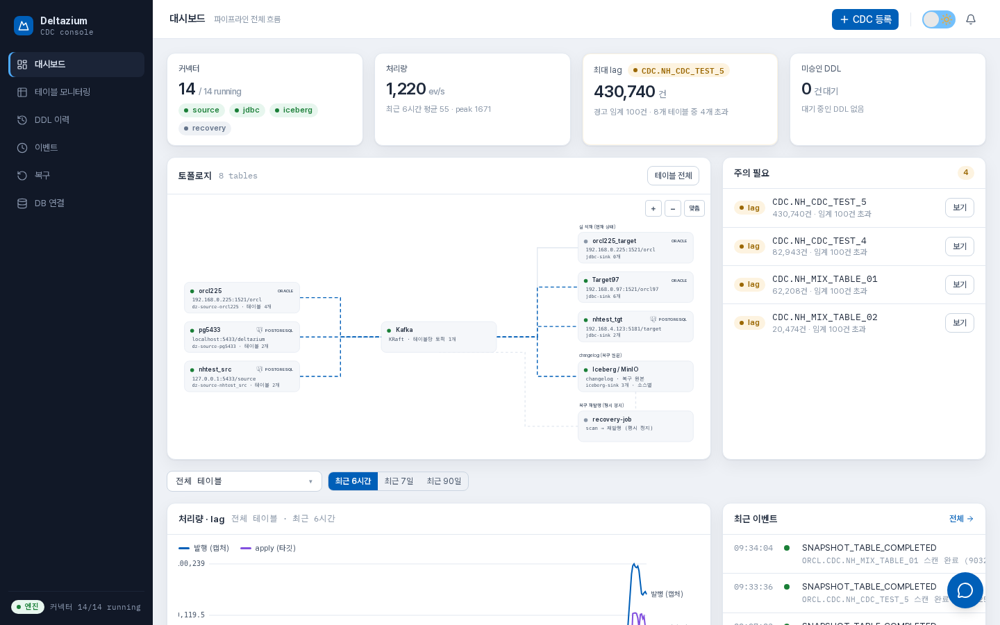
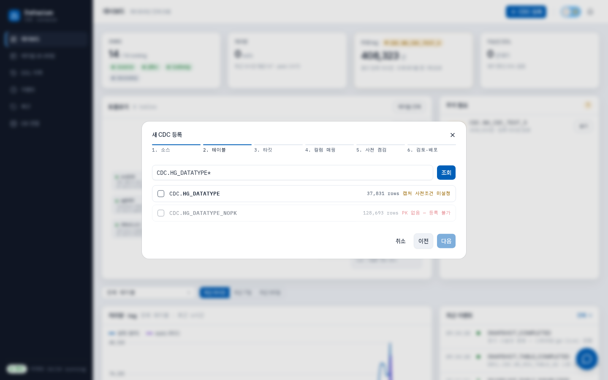
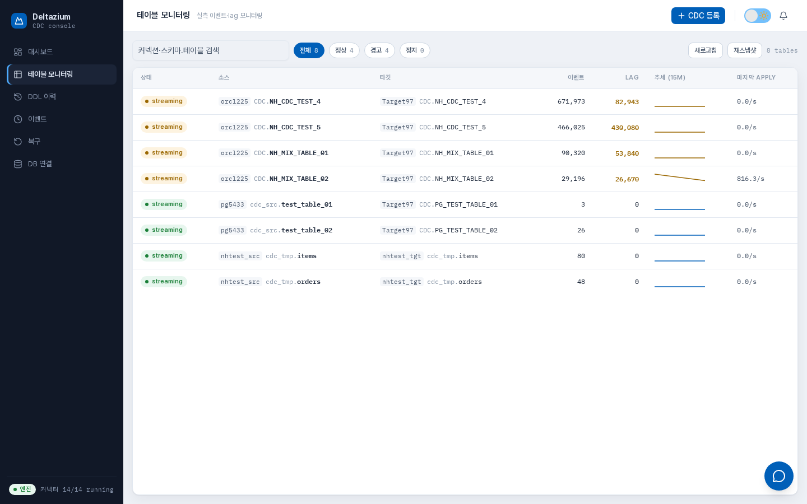
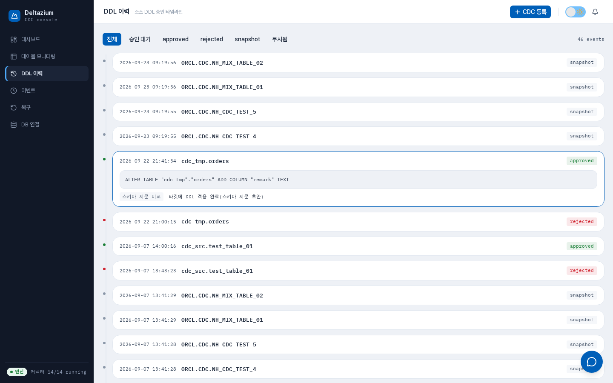
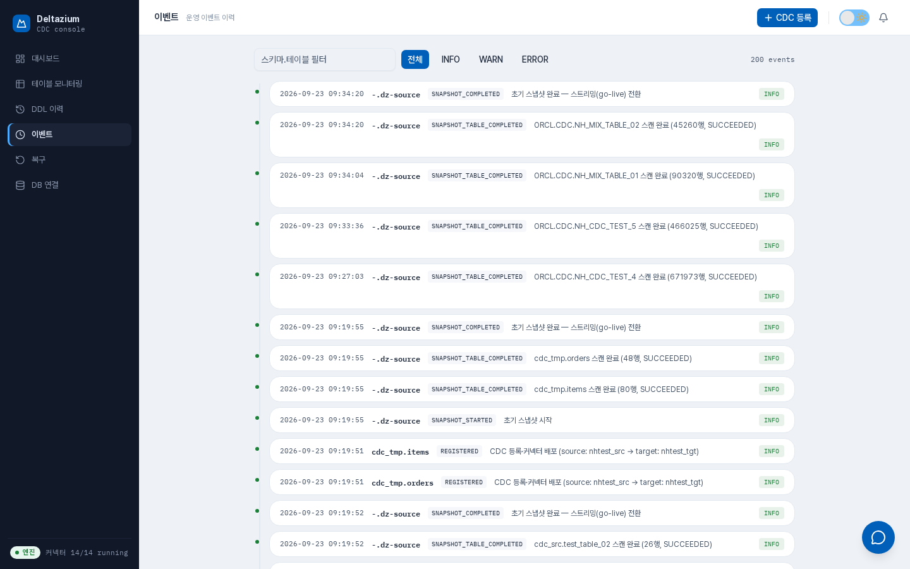
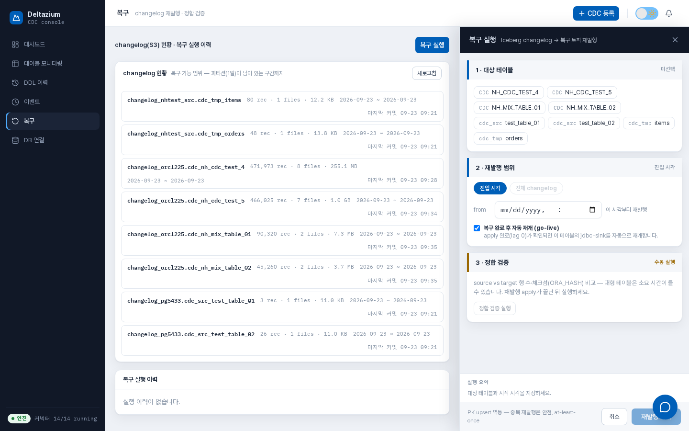
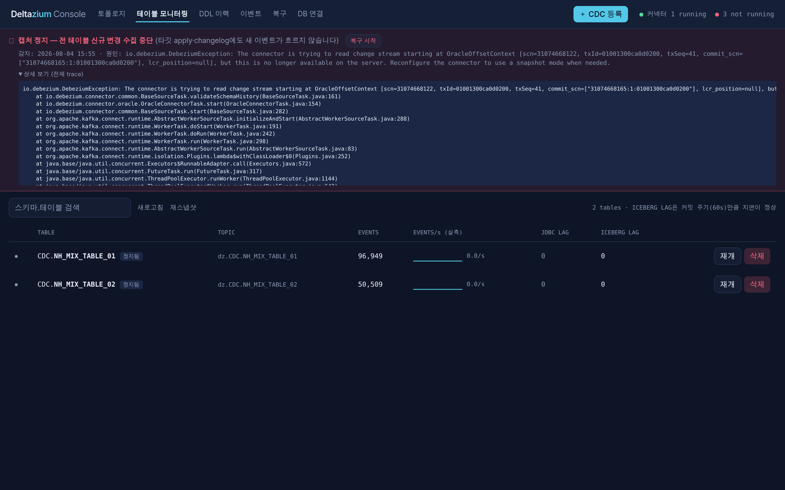
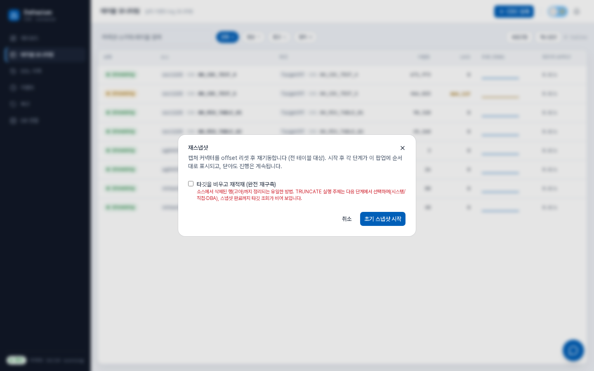
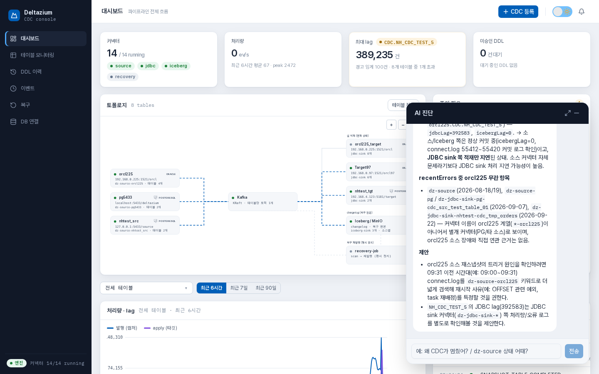

# Deltazium

Debezium + Kafka 기반 Oracle CDC 파이프라인과 이를 제어하는 웹 콘솔.

같은 CDC 스트림을 두 갈래로 병행 적재한다 — **타깃 Oracle에 실 적재**(현재 상태 유지)와
**Iceberg에 append-only changelog 보관**(특정 SCN 시점부터의 복구 재생용). 그 위에
테이블 등록·사전 점검·DDL 승인·복구 트리거를 담당하는 제어면(Spring Boot + React)을 얹었다.

> 상용 CDC 솔루션(DeltaStream) 개발 경험을 바탕으로, Kafka 스택에서 CDC 시맨틱
> (envelope, 스냅샷 일관성, 멱등 apply, 복구 재생)을 검증하기 위해 만든 프로젝트다.

## 아키텍처

```
Oracle(SRC) ──Debezium source(LogMiner)──▶ Kafka(KRaft) ──┬─▶ Debezium JDBC sink ──▶ Oracle(TGT)
                                                          └─▶ Iceberg sink (append) ─▶ Iceberg / MinIO(S3)
                                                                카탈로그: JDBC (PostgreSQL)

복구: recovery-job ──(Iceberg scan · envelope 재조립)──▶ 복구 토픽 ──▶ 동일 JDBC sink 설정 ──▶ Oracle(TGT)

[Web UI(React)] ⇄ [backend(Spring Boot): Connect REST 프록시 · 테이블 등록 · 사전 점검 · DDL 승인 · 복구 트리거]
```

| 컴포넌트 | 역할 | 보존 |
|---|---|---|
| Kafka | 짧은 버퍼, fan-out (두 sink가 독립 consumer group — lag 격리) | retention 24h |
| Iceberg/MinIO | 장기 이력, 복구 원본 | 파티션 drop으로 보존 관리 |
| Oracle 타깃 | 현재 상태 | — |

## 직접 작성한 것 / 가져다 쓴 것

**직접 작성 (이 리포의 전부):**

| 모듈 | 내용 |
|---|---|
| `backend/` | Spring Boot 3 제어면 — DB 연결 저장소(Oracle 연결 테스트), 소스 딕셔너리 조회(와일드카드 전개), 사전 점검(PK·supplemental logging·LogMiner 권한 8종 — 누락 시 DBA GRANT 안내·배포 차단), 컬럼 매핑 검증, 커넥터 템플릿 렌더링·배포(Connect REST), changelog 테이블 사전 생성(JdbcCatalog), 스냅샷 모드 선택, CDC 정지/재개/삭제(offset 정리 포함), DDL 승인 워크플로(schema change topic 상시 소비·비전파성 DDL 자동 무시·타깃 이름 치환), 복구 트리거·정합 검증·go-live 자동 재개, 테이블별 운영 이벤트 이력(커넥터 장애 전이 trace 적재), Kafka 실측 메트릭(offset·lag), AI 진단 어시스턴트(Claude tool use — 읽기 전용 도구 2종: 파이프라인 상태 요약·로그 검색, 근거 강제, prompt caching으로 진단당 ~$0.1). 메타데이터 쿼리는 MyBatis 매퍼 XML |
| `ui/` | React 19 + TypeScript 콘솔 — 토폴로지 캔버스(React Flow, 커넥터 상태 실시간), 6단계 등록 위저드(딕셔너리 조회→컬럼 매핑→사전 점검→배포), 테이블 모니터링 그리드(실측 lag·정지/재개/삭제), DDL 타임라인(승인/거부), 운영 이벤트 타임라인, 복구 화면(changelog 현황 브라우저 포함), AI 진단 플로팅 위젯(SSE 스트리밍·도구 진행 표시·마크다운 답변) |
| `recovery-job/` | 플레인 Java — Iceberg scan(SCN 필터·순서 복원) → envelope 재조립 → 복구 토픽 발행. 왕복 동등성 테스트 |
| `connectors/` | 커넥터 설정 템플릿 4종 (설정 키 전수 공식 문서 검증) |
| `deploy/` | 베어메탈 설치·기동·smoke test 스크립트 (멱등), 로그 위치 표준화 |
| `docs/` | 설계 기준 문서, 실측 실험 기록 |

**가져다 쓴 것 (리포 밖에 바이너리로 설치):** Kafka 4.3.1(KRaft), Debezium Oracle/JDBC
커넥터 3.6.0.Final(공식 플러그인 배포판), Apache Iceberg Kafka Connect sink 1.11.0
(프리빌드 배포판이 없어 소스 빌드), MinIO, PostgreSQL 15.

데이터 경로에는 기성 커넥터만 쓰고 자체 코드는 제어면·복구·UI에만 두는 것이 설계 원칙이다
(apply 시맨틱을 단일 경로로 유지 — 복구 결과가 live 적재와 달라지는 사고를 차단).

## 핵심 설계 판단 (근거는 docs/에)

- **changelog 스키마를 실측으로 개정** — 원안(평탄화 스키마)이 스톡 커넥터·SMT 조합으로
  구현 불가함을 실험으로 증명하고(스톡 SMT는 중첩 필드 승격 불가, 기존 변환 SMT는 before
  이미지를 소실), envelope-as-is 저장 + backend 사전 생성 + `truncate(source.ts_ms, 1일)`
  파티션으로 확정. → [docs/experiments/2026-07-24-iceberg-sink-schema.md](docs/experiments/2026-07-24-iceberg-sink-schema.md)
- **멱등 apply 전제** — 전달 보장이 at-least-once이므로 apply는 PK 기반 upsert(MERGE)로
  몇 번 적용해도 같은 결과가 되게 한다. 복구 재생의 경계 중복을 정밀 절단 없이 흡수하는 근거.
  PK 없는 테이블은 등록 단계에서 거부.
- **복구는 재발행 단일 경로** — recovery-job은 Iceberg scan → envelope 재조립 → 복구 토픽
  발행까지만. apply는 live와 동일한 JDBC sink 설정이 담당.
- **캡처 계정 최소 권한 8개 도출** — 실 배선에서 권한 실패를 재현하며 Debezium 문서의
  보수적 목록(20여 개)을 8개로 압축. `DBMS_LOGMNR_D`가 필요한 이유(redo_log_catalog 전략)와
  `FLASHBACK ANY TABLE`의 용도(초기 스냅샷 전용)를 구분해 문서화. → [docs/architecture.md 8절](docs/architecture.md)
- **사전 점검이 배포를 게이트** — ARCHIVELOG·supplemental logging·권한을 등록 위저드에서
  검사. 자가 적용 가능한 것(테이블 supp.log)은 DDL을 보여주고 사용자 승인 후에만 실행,
  불가능한 것(권한)은 DBA용 GRANT 스크립트를 생성해 안내하고 통과 전 배포를 차단.
- **LogMiner 전략을 장애 실측으로 전환** — redo_log_catalog가 공유 dev Oracle에서
  ORA-1371 재시도 루프로 캡처를 멈추는 것을 재현·진단하고 online_catalog로 전환
  (schema change 이벤트는 양 전략 모두 발행되므로 DDL 워크플로 유지). 커넥터 삭제 후
  재등록 시 잔존 offset으로 스냅샷이 SKIP되는 함정도 실측으로 잡아 등록 해제 시 offset
  정리를 자동화. → [connectors/README.md](connectors/README.md)
- **운영 동작의 원칙화** — jdbc-sink는 테이블별 커넥터(타깃 이름 매핑·테이블 단위
  정지·DDL 거부 격리), recovery-sink는 apply 완료(lag 소진) 감지 후 자동 정지("평시 정지"
  원칙), 복구 완료 시 자동 재개(go-live)로 "정지 → S3 복구 → 라이브 복귀"가 한 조작으로 완결.

## 화면

| | |
|---|---|
|  |  |
| 대시보드 — 토폴로지(커넥터 상태 실시간) + 처리량(발행 vs apply)·lag 시계열 + 컴포넌트 자원(/proc 실측) + 최근 운영 이벤트 | 등록 위저드 — 딕셔너리 조회, PK 없는 테이블 선택 차단, supp.log 경고 |
|  |  |
| 테이블 모니터링 — 실측 이벤트·lag, 정지/재개/삭제 | DDL 이력 — 수집·승인/거부·자동 무시 |
|  |  |
| 운영 이벤트 타임라인 — 장애 전이 trace 포함 | 복구 — changelog(S3) 현황·SCN 재발행·go-live·정합 검증 |
|  |  |
| 캡처 장애 경고 배너 — task FAILED 실측 화면. 감지 시각·근본 원인(Caused by)·전체 trace 펼침 + [복구 시작]. connector RUNNING/task FAILED 불일치로 나흘간 숨어 있던 실제 장애를 계기로 추가 | 재스냅샷 위저드 — 유입 차단→잔량 소진→타깃 비우기(실행 주체 승인·권한 홀드)→offset 리셋→초기 스냅샷(notification 실측 행수)→go-live. 실제 장애 복구에 사용된 run(10.5만 행, 50초) |
|  | |
| AI 진단 — 우하단 플로팅 위젯. 질문을 받으면 상태 조회·로그 검색 도구를 스스로 호출해 로그 라인 근거와 함께 원인을 짚는다(사용 도구는 답변 위에 표시). 화면은 dz-source의 LogFileNotFoundException 장애를 진단한 실측 대화 | |

## 실행

```bash
./deploy/install-runtime.sh   # 최초 1회: Kafka·MinIO·플러그인 설치 (Iceberg sink는 소스 빌드)
./gradlew build               # backend + recovery-job (테스트 포함)
cd ui && npm install && cd ..

./deploy/dzadmin all start    # 인프라(pg→minio→kafka→connect) → backend(8090) → web(5173)
./deploy/dzadmin status       # 전체 상태 요약 — 컴포넌트별 start/stop/restart는 --help 참조
```

Oracle은 별도 준비 필요 — ARCHIVELOG 모드, 캡처 계정 권한은 위저드 사전 점검이 안내한다.
통합 테스트(실 인프라 대상): `./gradlew :backend:test -Dintegration=true`

## 검증된 것 / 진행 중인 것

- ✅ 실 Oracle 대상 end-to-end: 초기 스냅샷(3만+ 행) → LogMiner 실시간 스트리밍 →
  타깃 Oracle apply(lag 0) + Iceberg changelog 커밋(evolve-schema로 before/after 자동
  생성)까지 실트래픽으로 확인. 캡처 장애(ORA-1371) 재현 → 전환 → 밀린 구간 유실 0 회수 포함
- ✅ envelope 왕복(재조립 동등성) 테스트, changelog 사전 생성 통합 테스트,
  changelog 73건 재발행 스모크(복구 경로)
- ✅ 모니터링 실측화: 토픽 offset·sink별 consumer lag(AdminClient), DDL 이벤트 수집,
  커넥터 장애 전이 이벤트(trace 포함)
- ✅ 캡처 장애 실전 복구: 공유 dev Oracle의 archive log 삭제로 재개 지점이 소실된
  실제 장애(task FAILED, 나흘 경과)를 재스냅샷 위저드로 복구 — 타깃 truncate 재구축
  포함 50초 만에 go-live, 진행률은 Debezium notification 실측. 이 장애를 계기로
  task 상태 집계(UI가 connector 상태만 보던 착시)·장애 배너·단계형 복구 절차가 추가됨
- ⏳ 복구 리허설 풀 사이클(타깃 훼손 → SCN 재발행 → 정합 검증 일치) — 기능은 갖춰짐, 실행 검증 대기
- ⏳ 테이블별 incremental snapshot(기동 중 테이블 추가 시 초기적재 — Kafka signal),
  컬럼 리네임의 적재 반영(스톡 sink 한계로 저장만 — 방침 결정 대기)

## 문서

| 문서 | 내용 |
|---|---|
| [docs/architecture.md](docs/architecture.md) | 설계 기준 문서 — 모든 구현 판단의 근거 |
| [docs/operations.md](docs/operations.md) | 운영 가이드 — 화면 안내, 장애 대응·복구 절차 |
| [docs/internals.md](docs/internals.md) | 구현 내부 노트 — 상태 판정·재스냅샷 상태 기계·모니터링 파이프라인·밟은 함정들 |
| [docs/incidents/](docs/incidents/2026-08-04-archive-log-loss.md) | 실장애 기록 — archive log 소실 장애의 타임라인·진단·파생 개선 |
| [docs/experiments/](docs/experiments/2026-07-24-iceberg-sink-schema.md) | 실측 실험 기록 — 설계 개정의 근거 |
| [docs/TODO.md](docs/TODO.md) | 백로그 (Prometheus/Grafana, incremental snapshot 등) |

## 스택

Java 21 · Spring Boot 3.5 · React 19 + TypeScript + Vite · Tailwind CSS 4 + shadcn/ui ·
TanStack Table · React Flow · Kafka 4.3 (KRaft) · Debezium 3.6 · Apache Iceberg 1.11 ·
MinIO · PostgreSQL 15
